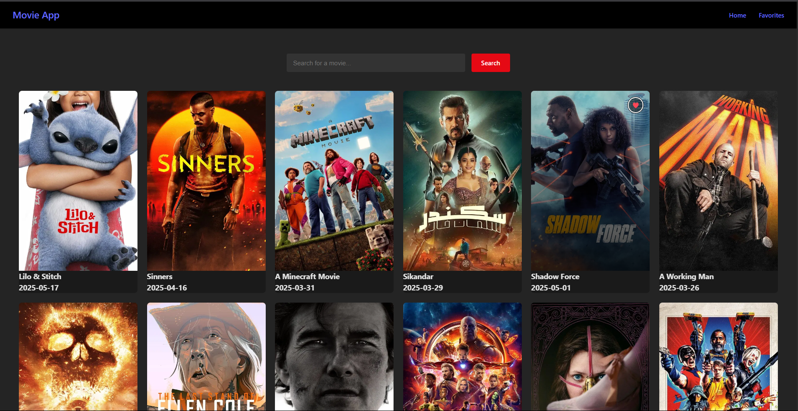
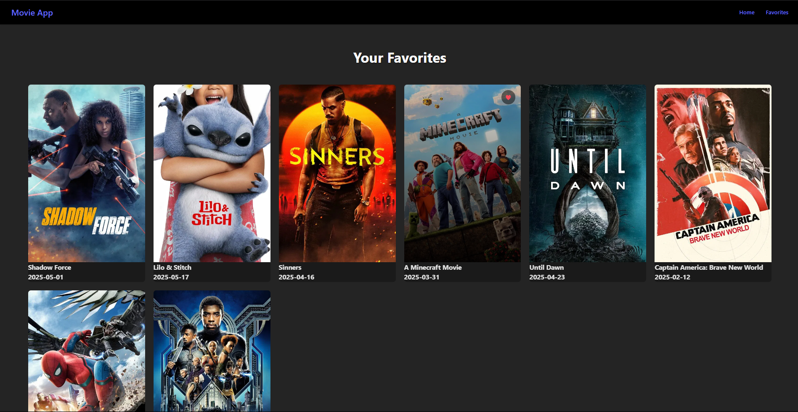

# 🎬 Movie App

A modern movie search and favorites app built with React. This app allows users to browse popular movies, search by title, and maintain a list of favorite movies — all with a clean UI and smooth experience.

## 🚀 Features

- 🔍 Search movies using the TMDB API
- ❤️ Add and view your favorite movies
- 🎨 Responsive and modern UI
- ⚡ Smooth loading states and error handling
- 📦 Clean component-based architecture

## 🛠️ Technologies Used

- React.js
- CSS3
- JavaScript (ES6+)
- TMDB API

## 📸 Preview

> Add a deployed link or screenshot GIF if available

Try it live: [your-deployment-link](https://your-deployment-link.com)

## 📂 Folder Structure

movie-app/
├── public/
├── src/
│   ├── components/
│   │   └── MovieCard.jsx
│   ├── css/
│   │   └── Home.css
│   ├── services/
│   │   └── api.js
│   ├── pages/
│   │   └── Home.jsx
│   └── App.js
├── README.md
└── package.json

## 🧪 Setup Instructions

1. **Clone the repository:**

   git clone https://github.com/gouthamnandula/Movie-List
   cd movie-app

2. **Install dependencies:**

   npm install

3. **Get a TMDB API key:**

   * Visit [https://www.themoviedb.org/](https://www.themoviedb.org/)
   * Sign up and generate an API key from your dashboard.

4. **Create a `.env` file in the root and add:**

   VITE_TMDB_API_KEY=your_api_key_here

5. **Start the app:**

   npm start

## 🧹 Notes

* If some results return as "undefined", it may be due to missing data in the TMDB response.
* Add error boundaries and fallback posters to improve user experience.

## 🤝 Contribution

Contributions, issues and feature requests are welcome! Feel free to fork this project and submit a pull request.

## 📜 License

This project is licensed under the [MIT License](LICENSE).

---

### 💡 Credits

Data provided by [The Movie Database (TMDB)](https://www.themoviedb.org/).

